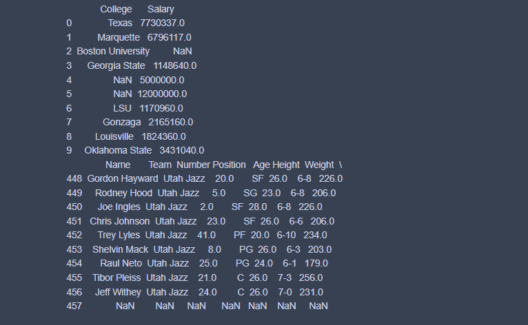
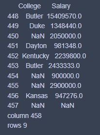

# Read-from-CSV

## AIM:
To write a python program to read data from CSV files.
## ALGORITHM:
### Step 1:
Start the python.
### Step 2:
Import pandas.
### Step 3:
Mention the CSV file which is to be read.
### Step 4:
Read the contents of the CSV file using df.read function
### Step 5:
End the program.
## PROGRAM:
```
#Name:Sai Darshan G
#Reference Number:21003195
import pandas as pd
df=pd.read_csv('nba.csv')
print(df.head(10))
print(df.tail(10))
print("column",len(df.axes[0]))
print("rows",len(df.axes[1]))
```
## OUTPUT:



## RESULT:
A python program to read data from CSV files has been created successfully.